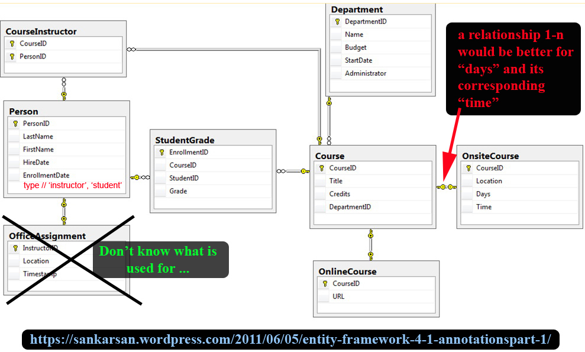

# Courses Organizer

## Aim
> We are going to use the API "Classrooms Organizer" to learn how to use **Ionic 3**.

## Enhanced Entity-Relationship

---
# BUILDING: EMPTY FOR NOW ...

---------------

## Author
* Dinh HUYNH - All Rights Reserved!
* dinh.hu19@yahoo.com